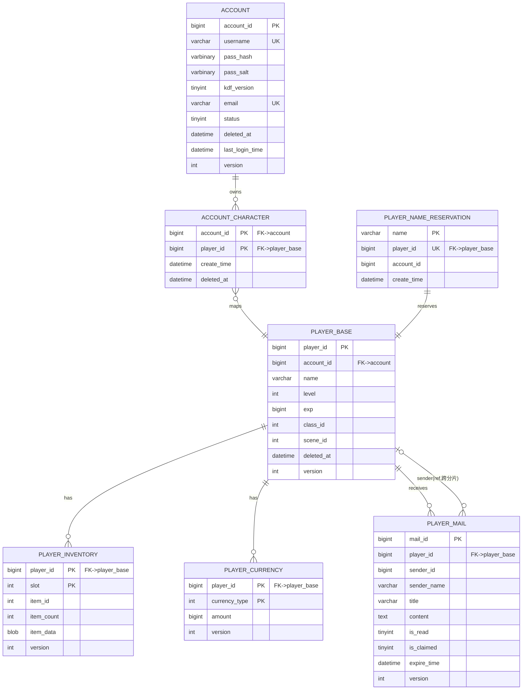

# CAMI 数据层 · 玩家分片 ER 图与 3NF 校验

> **文档状态**: [PRODUCTION] 设计稿 (Week 4 Day 1 — 2026-08-31)
> **关联**: `docker/mysql/schema.sql`(权威 DDL) · `docs/architecture/architecture-spec.md` §5.2 / ADR-003
> **交付物**: `schema.sql` + 本文档(ER 图) — 验收: 满足 3NF, 分片键统一 `player_id`

---

## 1. 数据库拓扑

```
                    ┌─────────────────────────────┐
                    │      cami_global (未分片)     │
                    │  account / account_character │
                    │  player_name_reservation     │
                    │  auction_* / guild_*         │
                    └──────────────┬──────────────┘
                                   │ account_id (逻辑引用)
                                   ▼
   ShardingSphere ── player_id % 8 ──► ┌──────────────────────────────────────┐
   (databaseStrategy)                  │ cami_shard_0 … cami_shard_7 (8 分库)  │
                                       │ player_base / player_inventory /      │
                                       │ player_currency / player_mail /       │
                                       │ player_equipment / player_quest /     │
                                       │ player_skill / player_social          │
                                       └──────────────────────────────────────┘
```

- **玩家业务表**全部以 `player_id` 为分片键 → 同一玩家所有数据落在同一分库, 避免跨分片事务。
- **账号域**(`account`)先于角色存在, 无法以 `player_id` 路由 → 全局库; 其支撑表解决分片固有问题 (见 §4)。

---

## 2. ER 图 (Mermaid)



> 图也可作为独立图片查看: [`er-player-sharding.svg`](./er-player-sharding.svg)

---

## 3. 3NF 校验

### 3.1 1NF (原子性)
所有列均为原子值; `BLOB`(`item_data` / `attachments`)为不透明序列化体 (FlatBuffers), 视为单一原子列, 非重复组。✅

### 3.2 2NF (无部分依赖)
仅复合主键的表需校验:
- `player_inventory` PK(`player_id`,`slot`): `item_id`/`item_count`/`item_data` 均依赖**完整**主键 (某一槽位的物品) → 无部分依赖。✅
- `player_currency` PK(`player_id`,`currency_type`): `amount` 依赖**完整**主键 (某玩家的某币种) → 无部分依赖。✅
- 单键表 (`player_base`/`player_mail`/`account` 等) 2NF 自然成立。✅

### 3.3 3NF (无传递依赖)
逐表检查非键属性是否依赖于另一非键属性:
- `player_base`: `class_id` 是**配置引用** (外键语义, 指向全局 class 定义), 非由其它列派生; `account_id` 同理为引用 → 无传递依赖。✅
- `player_inventory` / `player_currency`: 列均为键、引用或独立属性 (`item_count`/`amount`) → 无传递依赖。✅
- `account` / `account_character` / `player_name_reservation`: 均为键或独立属性 → 无传递依赖。✅

### 3.4 已记录的、刻意的"反 3NF" (必须透明)
| 表 | 列 | 违反点 | 理由 (可接受) |
|----|----|--------|---------------|
| `player_mail` | `sender_name` | 依赖非键 `sender_id` | 发件人可能位于**其它分片**, 跨分片 JOIN 不可行; 保存**发送时刻快照**, 非实时引用 |
| `auction_listing`(全局) | `seller_name` | 依赖非键 `seller_id` | 卖家名快照, 同理由 (已在 init-global.sql) |

> 除上述两处**带快照语义**的刻意冗余外, 核心玩家表严格满足 3NF。

### 3.5 已知遗留 (本周范围外, 标记待办)
- `guild.member_count` (init-global.sql) 为 `guild_member` 的派生聚合, 属传递依赖。应改为查询计数或经触发器维护。本周任务不含公会表, 留待后续。🚩

---

## 4. 分片键统一性 & 账号域放置决策

**验收项 "分片键统一 playerID"**: 所有玩家业务表 (`player_base`/`inventory`/`currency`/`mail`/`equipment`/`quest`/`skill`/`social`) 均以 `player_id` 为分片键, 且为 **PRIMARY KEY 首列** (ShardingSphere 单分片路由 + 防广播的硬性要求)。✅

**账号域为何不在分片内**: 账号是登录身份, 先于角色创建, 无法用 `player_id` 路由。若强行把 `account` 也塞进分片库, 登录时需先知道 `player_id` 才能路由——而登录那一刻只有 `username`。因此:
- `account` / `account_character` / `player_name_reservation` 落在 **`cami_global` 全局库** (不按 player_id 分片)。
- 引入两张**分片支撑表**解决分片固有问题:
  - `account_character` —— 登录时 O(1) 列举"某账号下全部角色", 避免广播 8 分库。
  - `player_name_reservation` —— 把"角色名全服唯一"收口到全局库 (分片内 UNIQUE 无法跨 8 库约束)。

> ⚠️ **需确认的设计决策**: 上述"账号全局 + 两张支撑表"是当前推荐方案。若你倾向于"账号也按某种键分片"或"名称唯一走独立服务而非表", 请告知, 我据此调整 schema.sql 与 init-global.sql。

---

## 5. 与现有文件的衔接

| 文件 | 作用 | 本次变更 |
|------|------|----------|
| `docker/mysql/schema.sql` | **权威 DDL 文档** (本交付物) | 新建 |
| `docker/mysql/init-global.sql` | 全局库部署脚本 | 新增 `account` / `account_character` / `player_name_reservation` |
| `docker/mysql/init-shard.sql` | 分片库部署脚本 | `player_base` 加 `scene_id`/`deleted_at`、移除分片内 name UNIQUE; `player_inventory` 改为 PK(`player_id`,`slot`); `player_currency` amount 改 `BIGINT NOT NULL` 并注释整数单位; `player_mail` `id`→`mail_id` 并补全注释 |
| `docker/shardingsphere/config-cami_db.yaml` | 分片路由 | **Tuesday 任务**: `ds_${0..1}`→`ds_${0..7}`, 算法 `player_id % 2`→`% 8`, 加读写分离 |
| `docker/docker-compose.yml` | 本地 2 分库 | **Tuesday 任务**: 扩到 8 分库 (+8 从库) |

---

## 6. 后续 (本周)
- **D2**: ShardingSphere 8 分库路由 + 读写分离, 验证跨分片查询路由正确。
- **D3**: Redis 缓存代理 (读穿/写回 + 热点 key), 命中率≥95%。
- **D4**: 数据同步 (30s 落库 / 断线持久化 / 版本号 CAS)。
- **D5**: 版本校验模块 + 数据层压测 (单分库≥5000 TPS) + 周评审。
