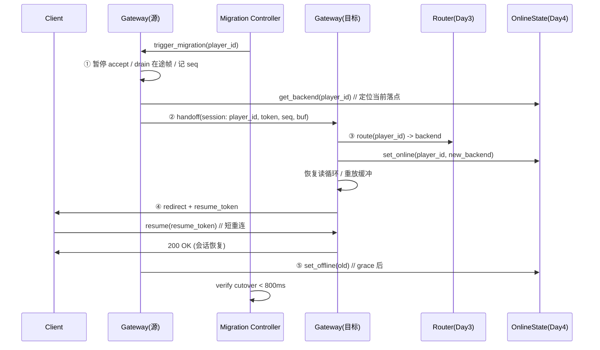

# 连接迁移设计（Connection Migration）

> **文档状态**: [DESIGN]  
> **版本**: v1.0.0  
> **更新日期**: 2026-08-28 (Week3 周五 — 连接迁移设计 + 周评审)  
> **所属层**: 接入层（gateway）  
> **上游规约**: `docs/architecture/architecture-spec.md`  
> **关联模块**: security(Day1) / ratelimit(Day2) / router(Day3) / redis(Day4)

---

## 1. 目标

在不中断玩家体验的前提下，把一条已建立的连接（及其玩家会话）从**源网关/后端**迁移到**目标网关/后端**，总停机时间可控在 **800ms** 内。迁移触发场景：网关灰度发布、后端扩容/缩容、节点故障转移。

本周前四天交付的四个网关模块，正是迁移路径上每个阶段的支撑能力；本设计明确它们的**集成缝**（仅文档化，不改 `ConnectionManager` 本体，遵循"后期模块不 mutate 早期模块"纪律）。

## 2. 800ms 迁移预算分解

| 阶段 | 动作 | 预算 |
|------|------|------|
| ① 上下文冻结 / drain | 源网关暂停新请求、flush 在途帧、记录 seq | 150ms |
| ② handoff 传输 | 会话上下文（player_id / token / seq / 缓冲）传到目标网关 | 200ms |
| ③ 新会话重建 | 目标网关 route(player_id) 选后端 + redis.set_online + 恢复读循环 | 200ms |
| ④ 客户端重定向 / resume | 下发 resume token，客户端用短重连恢复会话 | 150ms |
| ⑤ 旧网关优雅下线 | grace 期后 redis.set_offline(old) | 100ms |
| **合计** | | **800ms** |

> 各阶段预算为设计上限；实测以压测（周四 stress 套件 + 迁移专项）校准，写入 `balance.json` 类配置（若纳入数值平衡校验则同步 verifier）。

## 3. 集成缝总览（四模块如何接入迁移路径）

| 阶段 | 调用模块 | 集成缝（缝在 ConnectionManager 的调用点，不改本体） |
|------|----------|------------------------------------------------------|
| 新连接接入 / 迁移触发前 | **ratelimit** (Day2) | `ConnectionManager::on_accept` / `on_data` 处调用 `RateLimiter::check(ip)`；deny 类结果直接断连 |
| 首包鉴权 | **security** (Day1) | `on_data` 解析出 token 后调用 `TokenAuth::verify`；失败断连（token 由登录流程下发） |
| 选后端 | **router** (Day3) | 登录/迁移后调用 `Router::route(player_id)` 得到 game 后端；一致性哈希保证迁移前后命中的后端稳定（节点增减仅迁移 ~1/N key） |
| 在线态维护 | **redis** (Day4) | 会话建立/迁移完成调 `set_online(player_id, backend)`；下线/迁移走 `set_offline`；`get_backend` 供迁移控制器定位玩家当前落点 |

> 缝统一在 `ConnectionManager` 的 `set_on_accept` / `set_on_connection_closed` 挂钩（周五压测已加）处插入；本设计不新增对 `connection.cpp` 的修改。

## 4. 时序图

## 5. 故障与回滚

- **handoff 失败**：源网关保留会话，客户端无感知（仍在源）；控制器重试或标记迁移失败。
- **目标重建失败**：目标网关 `set_offline` 自身并通知控制器，源网关继续服务（回滚到源）。
- **redis 写入失败**：迁移不提交，源网关继续；在线态以源为准（最终一致性由下次成功写入收敛）。
- **客户端 resume 超时（>800ms）**：允许客户端走完整重连（登录态由 token 恢复），不保证零感迁移但保证不丢会话。

## 6. 验收与未闭环项

**本周已闭环（本地 ctest 8/8 绿）**：
- 四模块的单元/selfcheck 全部通过；迁移路径每个支撑能力均有确定性证据。

**待闭环（需在对应环境验证）**：
- **真实后端路径**：AES-GCM（MODULES=ON + OpenSSL）、RedisClusterState（MODULES=ON + redis-plus-plus + 运行 Redis Cluster）——沙箱 OFF 不覆盖，需 vcpkg CI job 端到端验证。
- **集成缝落地**：上述 4 处缝尚未在 `ConnectionManager` 中实际插入调用（本设计仅文档化）；落地为下周任务，严格遵守"不改 Connection 本体"纪律。
- **800ms 预算实测**：需迁移专项压测（真实网络/多网关）校准，非沙箱可证。
- **推送**：本地 4 个提交（ratelimit/router/redis + 本设计）待网络恢复后 push `dev` 触发 CI。

## 7. 周评审结论

Week3 完成网关四件套（鉴权/限流/路由/在线态）+ 连接迁移设计，架构闭环、职责清晰（ADR-002 边界严守）、每个模块独立 STATIC target 且轻量 CI 始终可编译验证。下周重点：集成缝落地 + 真实后端 CI 验证 + 800ms 迁移实测。
